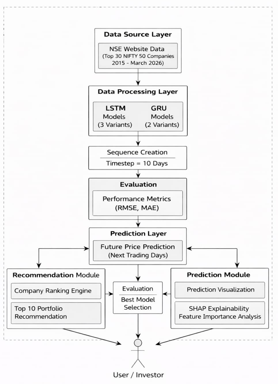
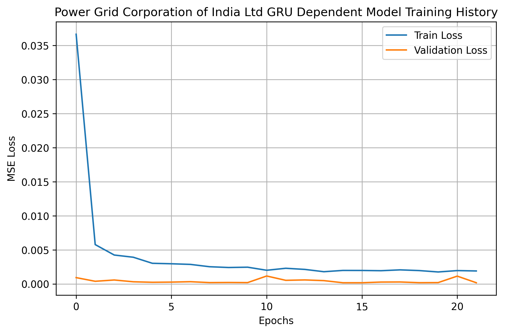
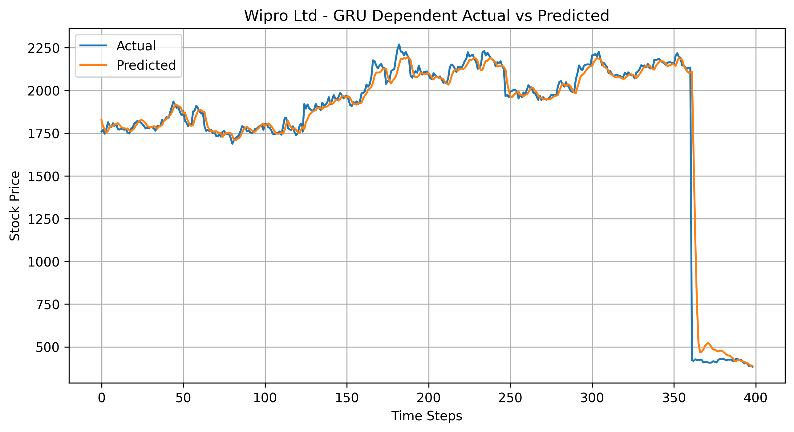
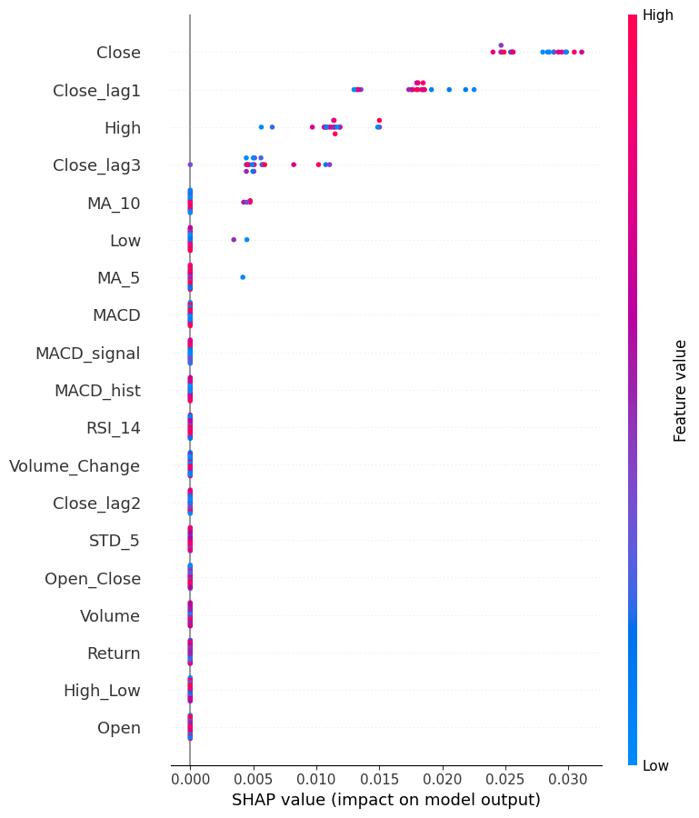

# 📈 Stock Market Trend Prediction and Investment Recommendation using Deep Learning

A deep learning-based framework for **stock market trend prediction and investment recommendation** using historical stock data of top NIFTY companies. This project leverages **LSTM**, **GRU**, and **Explainable AI (SHAP)** to predict stock trends and provide interpretable investment recommendations.

---


---

## 📑 Table of Contents

- [Project Overview](#-project-overview)
- [Features](#-features)
- [Technologies Used](#-technologies-used)
- [Repository Structure](#-repository-structure)
- [Dataset](#-dataset)
- [Model Architecture](#-model-architecture)
- [Project Workflow](#-project-workflow)
- [Performance](#-performance)
- [Results](#-results)
- [Project Screenshots](#-project-screenshots)
- [Installation](#-installation)
- [Usage](#-usage)
- [Future Improvements](#-future-improvements)
- [Research Recognition](#-research-recognition)
- [Author](#-author)

---

## 🚀 Project Overview

Predicting stock market movements is a challenging task due to the highly dynamic and nonlinear nature of financial markets. This project develops and evaluates multiple deep learning architectures for stock trend prediction and combines them with Explainable AI techniques to improve transparency and decision-making.

The project consists of:

- Data preprocessing and feature engineering
- Stock trend prediction using LSTM and GRU models
- Performance evaluation of multiple model architectures
- Investment recommendation based on predicted returns
- Explainability using SHAP

---

## 🌟 Key Highlights

- 📈 Deep Learning-based stock trend prediction using LSTM and GRU
- 🤖 Explainable AI with SHAP for transparent predictions
- 📊 Investment recommendation based on predicted stock performance
- 🏆 Research recognized with the **Best Paper Award – ICETEST 2026**

---

## ✨ Features

- Historical stock market data preprocessing
- Multiple LSTM and GRU architectures
- Multi-stock prediction framework
- Investment recommendation module
- Explainable AI using SHAP
- Performance evaluation using regression metrics

---

## 🛠 Technologies Used

Programming
• Python

Deep Learning
• TensorFlow
• Keras

Data Processing
• NumPy
• Pandas

Machine Learning
• Scikit-learn

Visualization
• Matplotlib
• Plotly

Explainability
• SHAP

Technical Analysis
• TA Library

Development
• Jupyter Notebook

---

## 📂 Repository Structure

```
Stock-Market-Trend-Prediction-and-Investment-Recommendation
│
├── notebooks/           # Jupyter notebooks
├── Images/              # Figures and screenshots
├── requirements.txt     # Python dependencies
├── LICENSE              # MIT License
├── .gitignore           # Ignored files
└── README.md

```

---

## 📊 Dataset

This project uses historical stock market data of top NIFTY companies.

**Note:** The dataset is **not included** in this repository due to GitHub file size limitations.

---

## 🧠 Model Architecture

The project explores multiple deep learning architectures including:

- LSTM (3 variants)
- GRU (2 variants - Independent and Dependent)

The Dependent Multi-Stock GRU model achieved the best overall performance.

---

## 📋 Project Workflow

1. Data Loading
2. Data Preprocessing
3. Feature Engineering
4. Model Training (LSTM & GRU)
5. Model Evaluation (RMSE, MAE)
6. Prediction
7. Investment Recommendation
8. Explainability using SHAP

---

## 📈 Performance

### Best Performing Model

**Dependent Multi-Stock GRU**

| Metric | Value |
|---------|--------|
| RMSE | 126.68 |
| MAE | 92.92 |

The model was evaluated on historical stock data and demonstrated strong predictive capability for financial time-series forecasting.

---

## 📊 Results

- Evaluated multiple LSTM and GRU architectures.
- Dependent GRU achieved the lowest RMSE and MAE.
- Generated investment recommendations based on predicted stock performance.
- Improved prediction transparency using SHAP explainability.

## 📸 Project Screenshots

### System Architecture



### Loss Curve



### Actual vs Predicted for Wipro by dependent GRU



### SHAP Explainability



---

## ⚙ Installation

Clone the repository

```bash
git clone https://github.com/Sania259/Stock-Market-Trend-Prediction-and-Investment-Recommendation.git
```

Install dependencies

```bash
pip install -r requirements.txt
```

---

## ▶️ Usage

1. Install the required libraries.
2. Place the dataset inside the project directory.
3. Open the notebooks.
4. Execute the notebooks sequentially.

---

## 🔮 Future Improvements

- Transformer-based architectures
- Real-time stock prediction
- News sentiment analysis
- Portfolio optimization
- Streamlit web application
- Deployment on cloud

---

## 🏆 Research Recognition

This project formed the basis of our research paper:

**"Stock Trend Prediction and Recommendation Using LSTM and GRU with Explainable AI."**

🏅 **Best Paper Award – ICETEST 2026**

---

## 👩‍💻 Author

**Sania Narendra Ayare**

Bachelor of Engineering (Information Technology)

Passionate about Machine Learning, Deep Learning, Data Science, and AI-driven Financial Analytics.

- GitHub: https://github.com/Sania259
- LinkedIn: linkedin.com/in/sania-ayare-885764319

---

## ⭐ Support

If you found this project useful, please consider giving it a ⭐ on GitHub.

Thank you for visiting!
